点击上方 Signal Board，进入我的个人网站

<h2>👋 关注 AI，也关注 AI 背后的人。</h2>

我是 <strong>FengLi / 李烽立，一名 AI 产品经理。</strong>

我围绕真实问题探索 AI 产品，从需求梳理、原型设计，到 Agent Skills 和工具实践。 
也把过程中的方法与经验整理成文档、文章和可复用的工作流。 
希望让技术回到具体的使用场景，把想法做成能用的东西。

<code>THINK</code> 从问题出发 &nbsp; · &nbsp; <code>BUILD</code> 动手验证 &nbsp; · &nbsp; <code>SHARE</code> 记录与分享

🌐 <a href="https://fengli-ai.github.io/">个人网站</a> · 📕 <a href="https://www.xiaohongshu.com/user/profile/69b6dd97000000003303a64d">小红书</a> · 📝 <a href="https://mp.weixin.qq.com/s/YZA2Fc5PAcy_8diKF-hQNA">公众号</a>

<h2>⭐ 代表作</h2>

<table>
  <thead><tr><th>Project</th><th>它解决什么</th><th>入口</th></tr></thead>
  <tbody>
    <tr><td>🧭 <a href="https://github.com/FengLi-AI/InTeam"><strong>InTeam</strong></a></td><td>面向企业内部的新员工入职助手，结合上手地图、知识问答与可确认的行动计划。</td><td><a href="https://github.com/FengLi-AI/InTeam">查看项目 ↗</a></td></tr>
    <tr><td>🎨 <a href="https://github.com/FengLi-AI/create-article-visuals"><strong>create-article-visuals</strong></a></td><td>为多平台文章策划、生成、检查与导出头图、正文配图和知识卡片。</td><td><a href="https://github.com/FengLi-AI/create-article-visuals">查看项目 ↗</a></td></tr>
    <tr><td>🧩 <a href="https://github.com/FengLi-AI/agent-blueprint-v1.3"><strong>agent-blueprint-v1.3</strong></a></td><td>把 Agent 需求映射到架构方案、Harness 组件与项目骨架，提供落地参考。</td><td><a href="https://github.com/FengLi-AI/agent-blueprint-v1.3">查看项目 ↗</a></td></tr>
    <tr><td>✍️ <a href="https://github.com/FengLi-AI/human-writing-fengliai"><strong>human-writing-fengliai</strong></a></td><td>覆盖中文选题、研究、写作、改稿与平台适配，让内容贴近真实材料与个人表达。</td><td><a href="https://github.com/FengLi-AI/human-writing-fengliai">查看项目 ↗</a></td></tr>
    <tr><td>🔎 <a href="https://github.com/FengLi-AI/analyze-internet-product"><strong>analyze-internet-product</strong></a></td><td>基于页面证据拆解用户旅程、产品机制与架构，输出可离线查看的分析报告。</td><td><a href="https://github.com/FengLi-AI/analyze-internet-product">查看项目 ↗</a></td></tr>
  </tbody>
</table>

<h2>🎯 我的关注</h2>

<ul>
  <li><strong>产品思考：</strong>从用户、场景和问题出发，判断 AI 应该参与哪一步。</li>
  <li><strong>动手实践：</strong>围绕 Agent、RAG 与工作流，做原型、工具和可复用的 Skills。</li>
  <li><strong>表达与分享：</strong>把技术探索整理成产品文档、视觉内容和可理解的方法。</li>
</ul>
